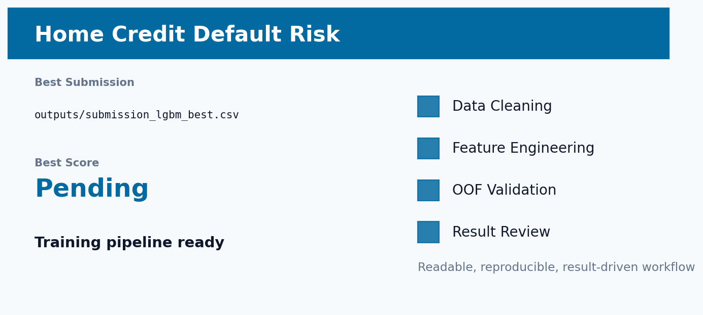

# Kaggle Home Credit 违约风险预测



## 项目一句话

利用主申请表和历史信贷行为预测贷款违约概率。

这个项目不是简单跑一个 baseline，而是围绕 **数据清洗 -> 特征工程 -> 稳定验证 -> 模型融合 -> 线上结果复盘** 做成一条完整建模链路。核心目标是：让模型不仅分数高，而且每一步为什么有效都能讲清楚。

## 当前结果

| 项目 | 内容 |
| --- | --- |
| Competition | `home-credit-default-risk` |
| Metric | `ROC-AUC` |
| Best Submission | `待生成：outputs/submission_lgbm_best.csv` |
| Best Score | Pending submission |
| Validation / Extra | 已整理训练脚本，待完整训练 |
| Status | 代码框架已发布，尚未记录线上分数 |

## 数据清洗

- 处理 DAYS_EMPLOYED 中的 365243 哨兵值，将其还原为缺失。
- 对多表大数据做 reduce_mem，降低内存压力。
- 统一清理 LightGBM 不友好的列名，避免特殊字符导致训练报错。

## 特征工程亮点

- 主表构造信用/收入、年金/收入、商品价格/信用、家庭人均收入等偿债能力特征。
- bureau 和 bureau_balance 聚合历史信用账户状态、逾期、负债比例和时间跨度。
- previous_application 分 approved/refused 聚合，识别客户过去申请质量。
- installments、POS、credit_card 聚合还款延迟、最低还款、授信使用率等行为风险。

这部分是项目最重要的地方：特征不是随便堆出来的，而是尽量贴近业务或数据生成逻辑。我的思路是先问“这个变量为什么会影响目标”，再把这个想法翻译成模型能理解的数值、类别、比例、交叉或序列表示。

## 模型方法

- LightGBM 5-fold StratifiedKFold，以 AUC 为目标。
- 提供 full relational FE 与 GPU fast 两个训练脚本。
- 输出 OOF、test prediction、submission、feature importance。

验证上尽量使用 OOF 思路，避免只看一次线上提交。融合也不是机械平均，而是根据 OOF、public/private 表现和模型互补性来选择。

## 结果分析

- Home Credit 的难点是多表关系建模，不是单表调参。
- 当前代码已经覆盖申请信息、历史信用、还款行为、信用卡使用四类风险视角。
- 下一步必须先跑出稳定 OOF 和线上分数，再围绕错误样本改特征。

## 如何复现

安装依赖：

```bash
pip install -r requirements.txt
```

复现时先从 Kaggle 下载原始数据到 README 或脚本约定的数据目录。部分仓库为了保持轻量，只保留最佳提交文件、实验日志和核心说明；如果仓库中存在 `src/`、`notebooks/` 或 `kaggle_kernel_*`，优先从这些入口运行训练。

常见入口示例：

```bash
python src/train_best.py
# 或在 Kaggle 上运行 kaggle_kernel_* 中的 GPU kernel
```

如果当前项目只保留了最佳产物，则可直接查看 `outputs/` 中的 OOF、prediction、submission 和实验摘要文件。

## 未来改进方向

- 加入最近 N 笔历史和时间衰减特征，让近期行为权重更高。
- 按 active/closed、approved/refused、late/early payment 分层聚合。
- 训练后补充 top feature importance 和 SHAP，形成风控解释报告。

## 项目价值

这个项目可以体现三类能力：

- **建模能力**：能从 baseline 走到调参、融合和线上验证。
- **特征工程能力**：能把业务直觉、数据分布和模型输入连接起来。
- **复盘能力**：能说明为什么涨分、为什么不涨，以及下一步该往哪里优化。
